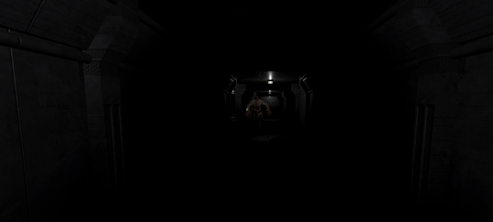
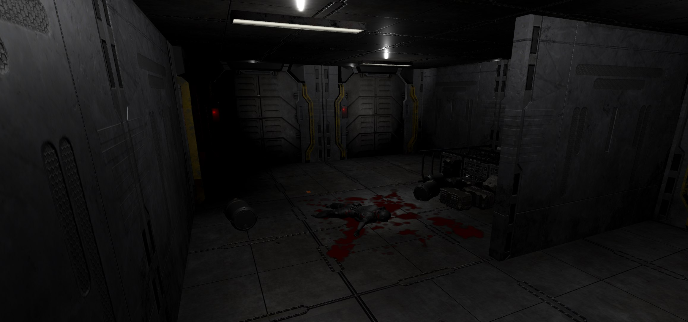
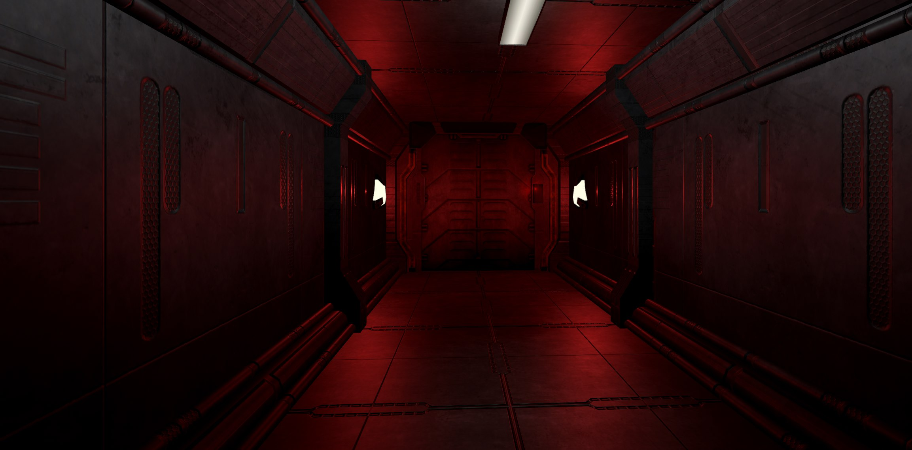
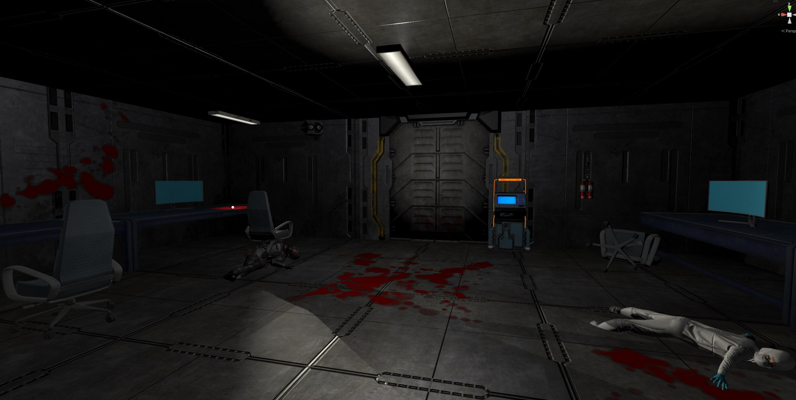

# VR Labyrinth

[Рус](../../README.md) | Eng

## Project description

The project is a game in which the user tries to escape from a labyrinth while being hunted by a monster. 

As the player approaches the monster, the character's heartbeat becomes audible, and the player can try to avoid the collision with the monster,
hide in a safe zone, or prepare to fight back. To escape the labyrinth, the player must obtain a keycard and use it to open the exit door.
To aid in the search for the first keycard, and then the door, the user can use the Exit Locator.

During the game, the user has access to several items located within the labyrinth:

* Pistol:
	Player can shoot the pistol to momentarily stop the monster. To shoot, the player needs to insert a magazine into the pistol grip.

* Magazine:
	Allows the player to shoot when inserted into the pistol. Contains 6 rounds.

* Flashlight: 
	Allows the player to illuminate parts of the labyrinth.

* Keycard:
	Allows the player to open doors to safe zones.

The game is designed for VR. 

Control is achieved using VR controllers:

* Left stick - movement;
* Right stick - rotation;
* X - use the exit locator (requires remaining in place);
* Y - quick magazine release;
* A - pause;
* Left/right trigger - use item in left/right hand;
* Left/right grip - hold item in left/right hand;

## Technologies:

* **Engine:** Unity
* **Programming language:** C# 
* **Version control system:** Git 
* **Monster and environment design:** Mixamo, Blender 

## Screenshots

### Gameplay

